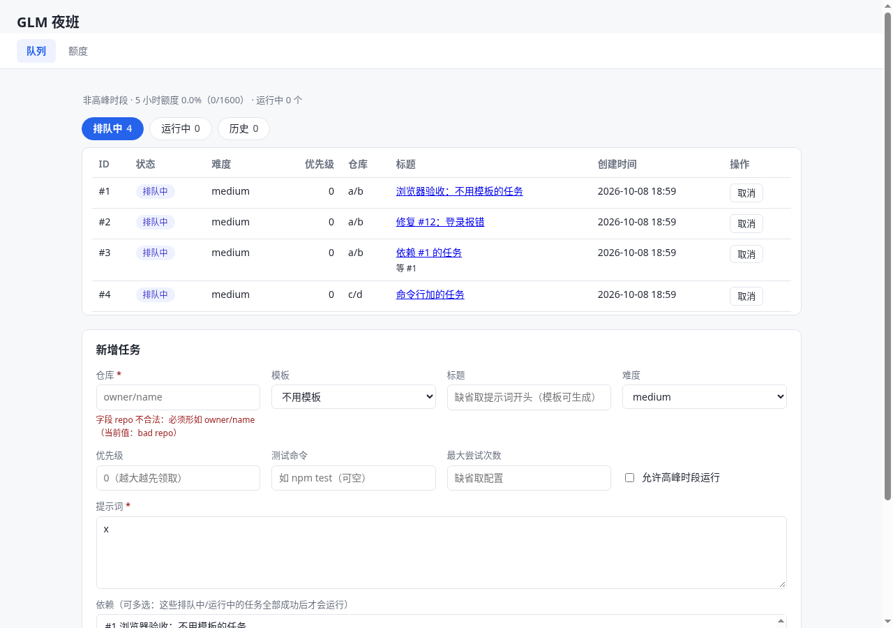
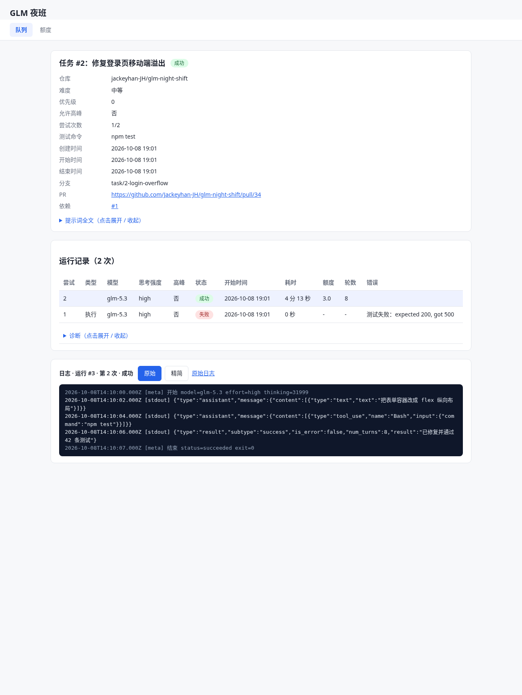
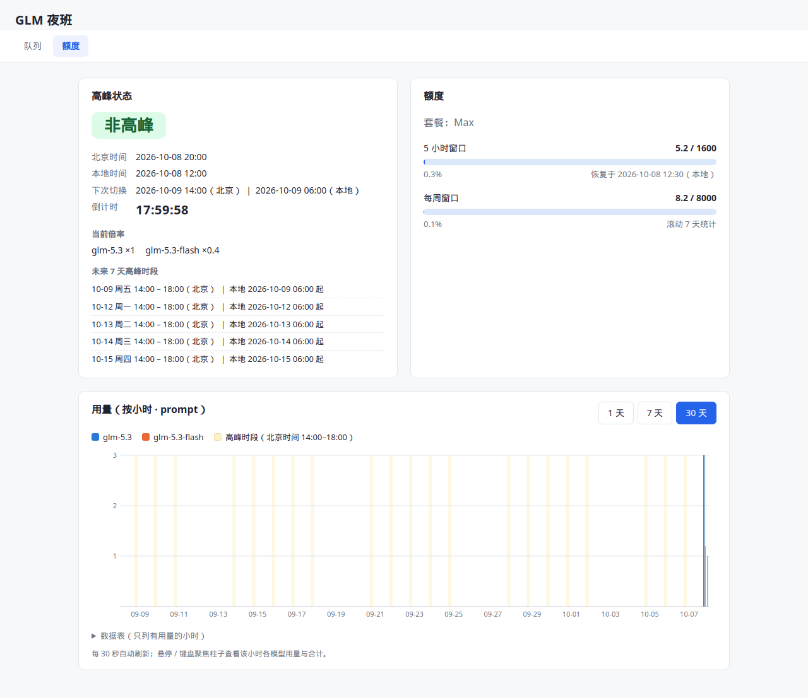

# GLM 夜班（glm-night-shift）

GLM 夜班：把编码任务排进队列，在 GLM 非高峰时段交给 Claude Code 自动完成并开 PR。

- 一条命令 `night-shift serve` 同时跑调度器与网页看板；`add` 进来的任务按优先级与依赖排队。
- 调度器在高峰与额度允许时领取任务：在独立 worktree 里让 Claude Code 无人值守干活、跑测试、提交、推送、开 PR。
- 每次运行都有完整日志与额度估算；普通失败先用便宜模型自动诊断、再重试；任务之间可以声明依赖。
- 零依赖：只需要 Node.js ≥ 22.13 和 git / gh / claude，不需要 `npm install`。

> ⚠️ **先读文末的「安全提醒」**：执行器用 `--dangerously-skip-permissions` 让 Claude Code
> 无人值守执行任意命令；请以专门的 Linux 用户运行并只给最小权限；看板没有登录，
> 默认只监听 `127.0.0.1`，不要暴露到公网。

## 安装

前提（Linux）：

- Node.js ≥ 22.13，推荐 24（`node:sqlite` 从 22.13 起无需开关；Node 22 加载它时 stderr 会
  多一条实验性警告，Node 24 不会）；
- `git`；
- 已登录的 GitHub CLI `gh`（`gh auth status` 能通过）；
- 已接入 GLM Coding Plan 的 Claude Code（终端里 `claude -p "hi"` 能正常返回）。

安装本身零依赖、不装任何 npm 包：

```bash
git clone <本仓库地址>
cd glm-night-shift
npm link          # 得到 night-shift 命令；不想 link 也可以直接 node bin/night-shift.mjs <命令>
```

数据目录默认 `~/.glm-night-shift`（可用环境变量 `NIGHT_SHIFT_HOME` 改），首次运行自动创建
`logs/`（运行日志）、`repos/`（仓库缓存）、`worktrees/`（任务工作副本）三个子目录。

## 快速开始

下面用 `owner/name` 指代你的 GitHub 仓库。

1. 添加一个任务：

   ```bash
   night-shift add --repo owner/name --prompt "把 README 的安装步骤补充完整" --test "npm test"
   ```

2. 一键启动调度器与看板：

   ```bash
   night-shift serve
   ```

3. 打开看板 `http://127.0.0.1:7788`（默认端口，可用 `--port` 或配置 `port` 修改）：能看到
   任务从排队、运行到成功的全过程，点进任务还能看实时日志。

4. 任务成功后，终端与看板都会给出 PR 地址，去仓库审代码、合并即可。

5. 用完按 Ctrl-C 停止：第一次优雅停止（不再领新任务，等运行中的任务收尾），再按一次
   强制停止；两种收尾退出码都是 0。

用模板修一个 issue（模板会用 `gh` 拉 issue 标题与正文渲染成 prompt，难度默认 medium）：

```bash
night-shift add --repo owner/name --template fix-issue --var issue=20
```

带依赖的两个任务（第二个要等第一个成功后才会被领取）：

```bash
night-shift add --repo owner/name --prompt "先做地基"          # 输出：已加入队列：#1 …
night-shift add --repo owner/name --prompt "在地基上盖楼" --depends-on 1
```

不想花额度先看看流程？`bash scripts/demo.sh` 用仓库里的假替身完整跑一遍（见[开发](#开发)）。

## 配置项全表

生效顺序：内置默认值 < `<数据目录>/config.json` < 环境变量。以 `src/config.js` 的
`DEFAULT_CONFIG` 为准，一个键都不少；详细说明与例子见 [docs/configuration.md](docs/configuration.md)。

| 配置键 | 默认值 | 含义 | 对应环境变量 |
| --- | --- | --- | --- |
| `concurrency` | `1` | 同时运行的任务数上限（正整数） | — |
| `timeoutMinutes` | `60` | 单次 claude 运行的超时（分钟） | — |
| `killGraceSeconds` | `10` | 超时/中止先发 SIGTERM，这么多秒后仍存活再 SIGKILL | — |
| `maxAttempts` | `2` | 每个任务的最大尝试次数（含首次），`add --max-attempts` 可单独覆盖 | — |
| `pollSeconds` | `30` | 调度器轮询队列的间隔（秒） | — |
| `port` | `7788` | 看板监听端口（1–65535；命令行 `--port` 优先） | `NIGHT_SHIFT_PORT` |
| `host` | `"127.0.0.1"` | 看板监听地址（不是回环地址时 serve 启动会打安全警告） | — |
| `plan` | `"v2-max"` | GLM 套餐名（额度估算用：v2-lite / v2-pro / v2-max） | — |
| `weekStart` | `null` | 周额度周期起点（下单时间，ISO 时间字符串）；`null` = 滚动 7 天窗口 | — |
| `safetyRatio` | `0.9` | 额度安全系数：used + 下次开销 ≤ 限额 × 该系数才放行 | — |
| `allowPeak` | `false` | 全局是否允许在高峰期领任务（任务的 `--allow-peak` 独立控制） | — |
| `claudeBin` | `"claude"` | claude 可执行文件 | `NIGHT_SHIFT_CLAUDE_BIN` |
| `ghBin` | `"gh"` | gh 可执行文件 | `NIGHT_SHIFT_GH_BIN` |
| `difficulty.easy` | `{ "model": "glm-5.3-flash", "effort": "low" }` | easy 难度 → 模型与思考强度 | — |
| `difficulty.medium` | `{ "model": "glm-5.3", "effort": "medium" }` | medium 难度 → 模型与思考强度 | — |
| `difficulty.hard` | `{ "model": "glm-5.3", "effort": "high" }` | hard 难度 → 模型与思考强度 | — |
| `effortThinkingTokens.low` | `0` | low 思考强度给 claude 的 MAX_THINKING_TOKENS（0 = 不开思考） | — |
| `effortThinkingTokens.medium` | `8000` | medium 思考强度的思考预算（token 数） | — |
| `effortThinkingTokens.high` | `32000` | high 思考强度的思考预算（token 数） | — |
| `remoteUrlTemplate` | `"https://github.com/{repo}.git"` | 任务仓库远端地址模板，占位符 `{repo}` `{owner}` `{name}` | — |
| `gitAuthorName` | `null` | 任务提交用的 git user.name；`null` = 沿用机器 git 身份 | — |
| `gitAuthorEmail` | `null` | 任务提交用的 git user.email | — |
| `testTimeoutMinutes` | `15` | 任务测试命令的超时（分钟） | — |
| `rateLimitBackoffMinutes` | `15` | 被限流（429）后的退避分钟数：全局暂停领取到该时刻 | — |
| `keepFailedWorktrees` | `false` | `true` 时失败任务的 worktree 保留现场不清理（见下文） | — |
| `autoDiagnose` | `true` | 普通失败且还有重试次数时，先用便宜模型诊断再重跑 | — |
| `diagnoseModel` | `"glm-5.3-flash"` | 失败诊断用的模型（只读，不开思考） | — |
| `diagnoseTimeoutMinutes` | `5` | 单次诊断的超时（分钟） | — |
| `systemctlBin` | `"systemctl"` | install-service / uninstall-service 调用的 systemctl | `NIGHT_SHIFT_SYSTEMCTL_BIN` |
| `oneTaskPerRepo` | `true` | 某仓库已有 running 任务时先不领它的其他排队任务（只在 concurrency > 1 时看得到；`false` 允许同一仓库并行，但它们都往同一默认分支开 PR，容易打架；不限制排队条数，同一仓库不分分支算同一把锁）「同仓库一个」（`oneTaskPerRepo`，默认 `true`）开着时，排队任务的仓库字符串和另一条正在跑的任务相同，队列行、详情页多出来的一行，以及命令行 list / show 的状态文字里都会出现「等这个仓库」；详情页这一行不替换暂停、额度、高峰或调度器没在跑。同仓库上其他还在排队的不算，只有正在跑的那条算；这句读的是磁盘上的配置，和正在跑的进程可能要等到重启才一致，也不改变谁会被领走。 | — |
| `autoFollowReviews` | `false` | `true` 时调度器在非高峰自动扫描已成功任务的 PR 评审（`follow --all` 同一套判定），有 CHANGES_REQUESTED 就入队跟进；`false` 时调度器不轮询、任何一轮都不为此调用 `gh`，想跟进手动跑 `follow` | — |
| `followPollMinutes` | `30` | 两次自动扫描至少间隔的分钟数（正数）；高峰期间不扫也不计时，高峰一结束的下一轮就能扫 | — |
| `prStatus` | `false` | `true` 时调度器定期用 `gh pr view` 查已成功任务 PR 的 state，把结论记到任务上（详情页出现「PR 结果：已合并 / 已关闭」行）；打开后**高峰也会查**（与 `autoFollowReviews` 相反），只写 `prOutcome`、不改变任务 status，已是 `merged` / `closed` 的不再查；`false` 时调度器不轮询、任何一轮都不为此调用 `gh` | — |
| `prStatusPollMinutes` | `30` | 两次 PR 状态查询至少间隔的分钟数（正数），高峰、手动暂停、限流退避期间照样计时 | — |

环境变量总览（详情见 [docs/configuration.md](docs/configuration.md)）：`NIGHT_SHIFT_HOME`
（数据目录）、`NIGHT_SHIFT_CLAUDE_BIN`、`NIGHT_SHIFT_GH_BIN`、`NIGHT_SHIFT_SYSTEMCTL_BIN`、
`NIGHT_SHIFT_PORT`（1–65535，非法值报错）；均以空字符串为「未设置」。
`NIGHT_SHIFT_NOW` 仅测试用（把「现在」固定住，非法时间直接报错）。

## 命令全表

退出码约定（所有命令一致）：

- `0` 成功；
- `2` 用法错误：未知命令/选项、缺必填参数、参数值不合法（含 `util.parseArgs` 的
  `ERR_PARSE_ARGS_*`），打印该命令的用法；
- `1` 运行时错误：校验失败、任务不存在、非法状态转换、端口被占用、调度器锁被别人持有
  等，中文原因输出到 stderr。

`start` 与 `serve` 的停止协议：第一次 Ctrl-C（SIGINT）或第一次 SIGTERM 是优雅停止
（不再领新任务，等运行中的任务收尾）。第二次信号是强制停止（中止运行中的任务并放回队列），
第二次也可以是 SIGTERM，不只是再按一次 Ctrl-C。`scheduler.stop()` 无论成功还是失败
（Promise 兑现或拒绝）进程都退出 `0`：收尾异常已经记在任务上，不会变成非零退出码。
帮助原文只写了「再按一次 Ctrl-C」，和「第二次 SIGTERM 也是强制停止」这一点不完全一致，
见 [docs/inconsistencies.md](docs/inconsistencies.md)。

| 命令 | 参数 | 作用 |
| --- | --- | --- |
| `add` | `--repo <owner/name>`（必填）＋ `--prompt <文字>` / `--prompt-file <路径>` / `--template <名字>` 三选一；可选 `--var <名字=值>`（可重复，配合模板）、`--title`、`--difficulty easy\|medium\|hard`、`--priority <整数>`、`--test "<测试命令>"`、`--allow-peak`、`--max-attempts <次数>`、`--depends-on <id,id,…>`、`--json` | 添加任务到队列。例：`night-shift add --repo a/b --template fix-issue --var issue=20 --allow-peak` |
| `list` | `[--status queued\|running\|succeeded\|failed\|canceled]` `[--limit <条数>]` `[--json]` | 列出任务（时间按本地时区显示到分钟） |
| `show` | `<id>` `[--json]` | 查看任务详情与运行记录 |
| `cancel` | `<id>` | 取消排队/执行中的任务 |
| `retry` | `<id>` | 把失败/已取消的任务重新排队 |
| `follow` | `<id>` 或 `--all [--json]` | 按 PR 的 CHANGES_REQUESTED 评审在**原 night-shift 分支**上入队跟进任务：gitRef 指向父任务分支、提交推回原分支并复用已有 PR（不新开）。结论不是 CHANGES_REQUESTED 时输出「没有待处理的修改请求」退出 0；默认不自动轮询（`autoFollowReviews` 开启后调度器自己扫，见下文） |
| `edit` | `<id>` ＋至少一个修改项：`--title`、`--prompt <文字>`/`--prompt-file <路径>`、`--difficulty easy\|medium\|hard`、`--priority <整数>`、`--test "<命令>"`/`--no-test`（清掉）、`--allow-peak`/`--no-allow-peak`、`--max-attempts <次数>`、`--depends-on <id,id,…>`/`--no-depends`（清空），可选 `--json` | 修改**排队中**的任务（出现才改，不给的保持原值；`repo`/`source` 等不能改）。不是排队中退出 1；依赖成环整体回滚。看板队列页排队中的行也有「修改」 |
| `start` | 无 | 前台运行调度器（只调度，不起看板） |
| `peak` | `[--json]` | 查看当前是否高峰、下次切换时刻与各模型倍率 |
| `usage` | `[--json]` | 查看额度用量（5 小时 / 每周，本地估算） |
| `logs` | `<id>` `[--run <n>]` `[--follow]` | 查看任务某次运行的日志。`--run` 缺省最新一次。`--follow` 跟到该次运行的 `finished_at` 有值、且日志文件安静了一个轮询周期后退出 0；若永远没有 `finished_at`，它不会自己停，用 Ctrl-C 结束（没有「第二次信号才强制」的处理器） |
| `run-now` | `<id>` | 立刻执行一次排队中的任务（无视高峰、额度、限流退避与 not-before，但**不绕过依赖**）；任务失败退出 1 |
| `pause` | 无 | 暂停领取新任务（正在跑的会跑完）。写在库里，和限流暂停分开；`run-now` 不受影响 |
| `resume` | 无 | 恢复领取新任务 |
| `deps` | `<id>` `[--set <id,id,…>]` | 查看或修改任务依赖（`--set ""` 清空；只读时不带 `--set`） |
| `config` | `[--json]` | 查看生效配置与数据目录各路径。`config set <键=值>…` 写入的键和设置页相同，正在运行的看板要重启后才按新值运行。 |
| `templates` | `[--json]` 或 `templates show <名字>` | 列出/查看任务模板（内置 + `<数据目录>/templates/` 自定义，同名覆盖内置） |
| `serve-api` | `[--port <端口>]` | 只起看板 HTTP 服务、不跑调度器（`--port 0` 随机端口） |
| `serve` | `[--port <端口>]` | 一键启动调度器与网页看板（`--port 0` 随机端口） |
| `install-service` | `[--dry-run]` `[--unit-dir <目录>]` | 把 `serve` 装成 systemd 用户服务（开机自启；`--dry-run` 只打印单元内容） |
| `uninstall-service` | `[--unit-dir <目录>]` | 卸载 systemd 用户服务 |
| `help` | 无 | 显示帮助（同 `--help`） |
| `import` | `--repo <owner/name>`（必填）；可选 `--label <名字>`、`--state open\|closed\|all`、`--limit <条数>`、`--difficulty easy\|medium\|hard`、`--dry-run`、`--json` | 按 GitHub issue 批量入队。已有同 source（`github:owner/name#编号`）的任务会跳过，`--dry-run` 只查询不入库 |
| `cleanup` | `[--dry-run] [--logs-older-than <天数>] [--json]` | 清理已结束任务的 worktree 和过期日志。只删 succeeded/failed/canceled 的 worktree，以及早于 N 天的 *.log（默认 14；0 表示不删日志）。不动 queued/running，不删数据库行和 repos/ 缓存 |

顶层还有 `--version` / `-v` 与 `--help` / `-h` 两个旗标；子命令以 `--help` 作为唯一参数时只打印该命令自己的用法。

### 任务依赖

- `add … --depends-on 1,2` 让新任务依赖给定 id 的任务（逗号分隔、容忍空格，空串 = 无依赖）；
  `deps <id>` 查看依赖与各自状态，`deps <id> --set 1,2` 修改（只限排队中的任务），`--set ""` 清空。
- 依赖的任务全部 `succeeded` 前不会被领取（调度器的正常领取和 `run-now` 都一样：`run-now`
  无视高峰、额度和退避，但不无视依赖）；依赖 `failed` 或被取消时，直接、间接依赖它的排队
  任务在同一事务里级联标为 `failed`（`last_error` 形如「依赖 #3 失败」）。
- 重试会把 `last_error` 指向它（或指向同一次被拉回来的下游）的失败任务一起重新排队；自己跑失败的下游不会被捎上。
- **依赖环只在 `deps --set` 时拒绝**（存储层 `setDependencies` 写入后查环）。`add` 和 HTTP
  创建任务都不会因为成环失败：新任务还没有任何入边，不可能靠它自己的 `dependsOn` 把图收成环。
  自己依赖自己在创建和修改时都会拒绝，那是「不能依赖自己」，不是环检测。

### PR 评审跟进与自动跟进

任务成功开出 PR 之后，`night-shift follow <id>`（或 `follow --all`）按 PR 的
CHANGES_REQUESTED 评审在原 night-shift 分支上入队跟进任务：gitRef 指向父任务成功时
推送的分支，提交推回原分支并复用原来那个 PR，不新开第二个。不想人守着看评审，把配置
`autoFollowReviews` 设为 `true`（默认 `false`：调度器不轮询，任何一轮都不为此调用
`gh`）：调度器只在**非高峰**、且距上次扫描至少 `followPollMinutes` 分钟（默认 30）时
做一次与 `follow --all` 完全相同的扫描，夜里自己把跟进任务排进队列。

- 只跟 `CHANGES_REQUESTED`，不跟 `APPROVED` / `COMMENTED`，也不会合并 PR；详情页对已成功、PR 还开着的任务有「跟进」按钮，判定与 follow 相同
  ——开了自动跟进，任务自己出现在队列里；没开就手动跑 `follow`。
- 详情页对排队中的任务有「立刻跑」按钮，确认后会无视高峰、额度和暂停领这一条；依赖没完成的不会跑。判定与命令行 `run-now` 相同。
- 查到的跟进任务照旧排队等领取：扫描只入队、不执行，领取仍走高峰 / 额度 / 暂停的原有
  规则（手动 `pause` 或限流退避期间只入队、不领取）。
- 高峰期间不扫描、也不把「刚查过」记上——高峰一结束的下一轮就可以扫，不必再等满
  `followPollMinutes`。
- 扫描中 `gh` 失败：记一条日志，本轮不再扫其余父任务；这次仍算查过，至少隔
  `followPollMinutes` 分钟才会再试。

## 看板

serve（或 serve-api）启动后浏览器打开 `http://127.0.0.1:<端口>`，共四页：

| 页面 | 文件 | 一句话说明 |
| --- | --- | --- |
| 队列 | `web/index.html` + `web/queue.js` | 任务总览与新增表单：排队中 / 运行中 / 历史三栏任务表、按模板建任务、高峰与额度概要 |
| 任务详情 | `web/task.html` | 单个任务的字段、每次运行记录（含失败诊断）、实时日志流；排队中的任务有「立刻跑」 |
| 额度与高峰 | `web/usage.html` | 当前高峰状态与各模型倍率、5 小时 / 每周额度进度、按小时用量图 |
| 设置 | `web/settings.html` + `web/settings.js` | 改常用开关（高峰、并发、同仓库一个、自动跟进、PR 状态、失败保留工作目录、单次超时、失败诊断）；写入配置文件，重启后才按新值运行 |







（截图取自各功能合并时的看板，界面细节可能与当前版本略有出入。）

两个页面同时取消同一个任务时，先到的成功；后到的因为任务已经是终态，接口返回 **409**
（`InvalidTransitionError`，非法状态转换，不是 400）。页面会把错误文本显示出来（队列页的
页面错误、详情页按钮旁的说明），但浏览器控制台仍会留下这条失败请求的红字。这是预期。

## 高峰与额度

- 高峰规则：**北京时间（固定 UTC+8，无夏令时）周一至周五 14:00–18:00**，区间左闭右开
  （14:00 算高峰、18:00 不算），周末全天非高峰。`night-shift peak` 查看当前状态与下次切换。
- 额度是**本地估算**，不是官方账单：按「每次 claude 运行 = 1 个 prompt × 模型倍率」累计
  （非高峰 glm-5.3 ×1 / glm-5.3-flash ×0.4，高峰 ×3 / ×1.2），再对照套餐限额
  （v2-lite / v2-pro / v2-max）判断还能不能开新运行。数字仅供调度参考，与官方账单口径
  可能不同。
- 高峰判定逻辑逐字节复制自
  [glm-peak-clock 的 src/peak.js](https://github.com/Jackeyhan-JH/glm-peak-clock/blob/main/src/peak.js)
  （规则表、倍率表见 `src/peak.js` / `src/quota.js`，改规则改这两处）。

## ⚠️ 安全提醒

- **执行器用 `--dangerously-skip-permissions` 旗标启动 Claude Code**：模型在无人值守的情况
  下可以执行任意命令——读写该 Linux 用户能访问的**所有文件**、联网、安装依赖。这是它能
  把任务做完的前提，也是它危险的地方。
- 建议用**专门的 Linux 用户**跑夜班：只给这个用户需要的仓库权限和单独的 gh token（最小
  权限），不要在存有重要凭据、生产权限的账号下运行。
- prompt 来自不可信来源时要当心**提示注入**：别人提的 issue 正文、PR 评论都可能被拼进任务
  prompt（模板 `fix-issue` 就会用 `gh` 拉 issue 正文渲染）。只对信任的仓库开任务，或先人工
  读一遍 issue。
- **看板没有任何登录**，默认只监听 `127.0.0.1`；把配置 `host` 改成非回环地址时 serve 启动
  会打安全警告。不要把看板暴露到公网。

## 调度器锁、worktree、并发名额与 prompt 处理

日常使用需要知道的四个产品约定（更细的说明见
[docs/configuration.md](docs/configuration.md)）：

1. **一个数据目录只跑一个调度器。** 限流暂停（pausedUntil）和依赖阻塞（blocked）状态只在
   调度器进程内存里，多个进程共用同一个数据目录**不会**共享它们。`serve` 与 `start` 启动时
   都会获取 `<数据目录>/scheduler.lock`，拿不到（已有活着的本程序进程持有）就退出 1。崩溃
   留下的过期锁（pid 已死，或 pid 活着但 cmdline 不像 night-shift）会被自动接管；正常退出时
   只删除仍写着自己 pid 的锁，绝不误删后继者的。
2. **keepFailedWorktrees 默认 `false`**：失败任务的 worktree 会清理掉。设为 `true` 时失败
   现场保留在 `<数据目录>/worktrees/` 下方便排查，但要留意磁盘占用；手动清理：先停掉调度
   器，再删除对应的 worktree 目录（不要在调度器运行时删可能正在使用的目录）。
3. **并发名额要等 worktree 清理完才释放**：任务结束后先清理 worktree、再释放并发名额、
   最后才发出 done 事件（收到 done 时名额一定已释放）。`concurrency` 为 1 时，任务刚成功后
   的下一次轮询可能空转一次，这是预期行为，不是丢任务。
4. **add 的 prompt 会去掉首尾空白（trim），正文中间的换行保留。** `--prompt-file` 分两步：
   先把文件内容原样读入、只去掉末尾一个换行（`\n` 或 `\r\n`），再走同一个 trim。也就是说
   首尾空白/空行不会保留，多行任务描述写在正文中间即可。

## 开发

- Node.js ≥ 22.13（推荐 24）；零依赖，没有 node_modules。跑测试：`npm test`
  （即 `node --test`，扫描 `test/` 下所有测试文件；e2e 套件在整理中，尚未做成 script）。
- `node --test` 会把 `test/` 下所有 `.js`/`.mjs` 当测试文件执行（包括 fixtures 与 helpers），
  这些文件被无参数运行时必须零副作用。
- 测试一律通过 `test/helpers.js` 的 `fakeEnv()` 构造子进程环境：指向仓库里的假替身、
  `NIGHT_SHIFT_HOME` 指向临时目录、剥掉真实凭据，**绝不调用真实的 claude / gh / systemctl，
  也不联网**（沙箱 PATH 上的 `systemctl` 是退出 99 的陷阱，忘覆盖也会 fail closed）。
- 文档一致性也有测试（`test/docs.test.js`）：`DEFAULT_CONFIG` 的每个键、help 里的每个命令
  都必须出现在 README，配置加了新键或命令而文档没写时测试会失败。

假替身一览（行为都由环境变量控制，详见各文件头注释）：

| 替身 | 环境变量 |
| --- | --- |
| `test/fixtures/fake-claude.mjs` | `FAKE_CLAUDE_SCENARIO`（success / fail / hang / slow / noop / rate-limit / truncated / stubborn）、`FAKE_CLAUDE_SEQUENCE`（逗号分隔的场景序列，需配 `FAKE_CLAUDE_STATE_FILE`）、`FAKE_CLAUDE_STATE_FILE`、`FAKE_CLAUDE_ARGS_LOG`、`FAKE_CLAUDE_DELAY_MS`、`FAKE_CLAUDE_RESULT_TEXT` |
| `test/fixtures/fake-gh.mjs` | `FAKE_GH_LOG`、`FAKE_GH_PR_NUMBER`、`FAKE_GH_FAIL`、`FAKE_GH_REPO`、`FAKE_GH_DEFAULT_BRANCH`、`FAKE_GH_EXISTING_PR_URL`、`FAKE_GH_BODY_COPY`、`FAKE_GH_ISSUE_FILE`、`FAKE_GH_ISSUE_JSON`、`FAKE_GH_ISSUE_FAIL` |
| `test/fixtures/fake-systemctl.mjs` | `FAKE_SYSTEMCTL_LOG`、`FAKE_SYSTEMCTL_FAIL` |

一键演示（只用假替身，不花额度、不联网）：

```bash
bash scripts/demo.sh          # 建临时 bare 仓库 + 3 个任务（含先失败后成功、含依赖），跑完自动清理
bash scripts/demo.sh --keep   # 同上，但保留数据目录、serve 留在后台，方便打开看板看
```

目录结构：

```
bin/night-shift.mjs   CLI 入口（子命令表 COMMANDS）
src/cli/              各子命令实现
src/config.js         默认配置、加载/合并/环境变量覆盖
src/tasks.js          任务与运行记录存储（node:sqlite）
src/scheduler.js      调度器：领取、闸门、流水线、重试、限流退避
src/runner.js         执行器：无人值守跑一次 claude，逐行记日志
src/diagnose.js       失败自动诊断（只读、便宜模型）
src/git.js            仓库缓存、worktree、提交推送、开 PR
src/peak.js           高峰判定（逐字节复制自 glm-peak-clock）
src/quota.js          额度估算与放行判定
src/server.js         看板 HTTP 服务与 API
web/                  看板四页（队列 / 任务详情 / 额度与高峰 / 设置）
templates/            内置任务模板（fix-issue、docs、refactor、add-tests）
test/                 测试、假替身（fixtures/）与辅助（helpers.js）
docs/                 配置详解（configuration.md）、已知不一致（inconsistencies.md）、截图
scripts/demo.sh       一键演示
```
